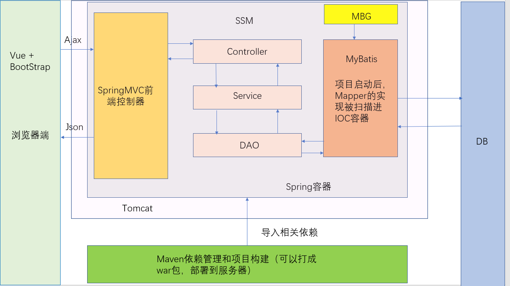
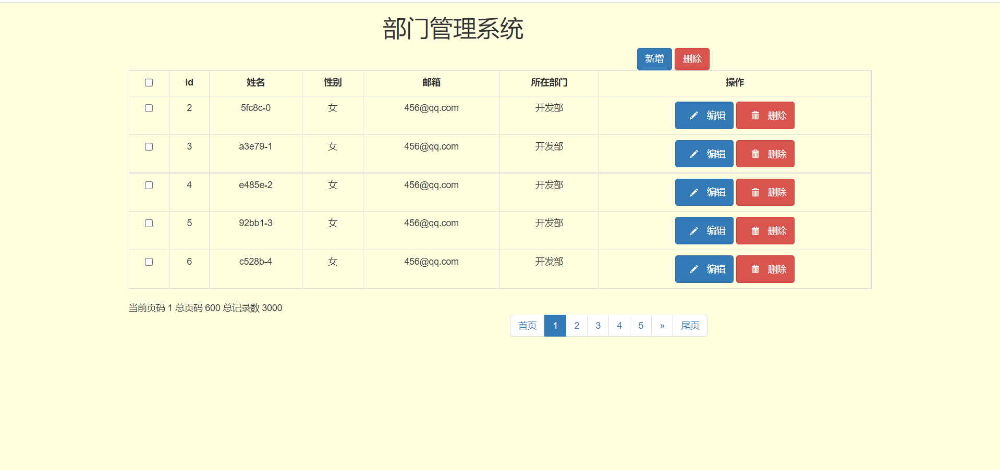
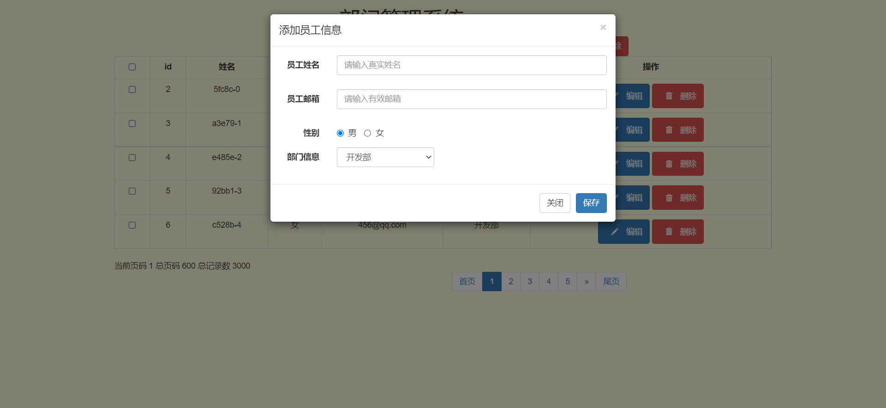
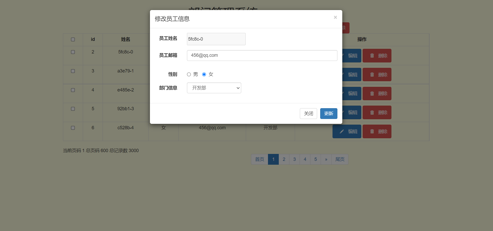

# SSM-CRUD：部门管理系统

## 一、技术栈

后端：SpringMVC + Spring + MyBatis + Maven + MySQL

后端分页插件：pagehelper 

前端：bootstrap + Vue + ajax

## 二、功能点

* 分页查询
* 数据校验
  * Vue前端校验 + JSR303后端校验
* 使用ajax发送请求
* Restful 风格的URL，使用HTTP协议请求方式的动词，来表示对资 源的操作（GET（查询），POST（新增），PUT（修改），DELETE （删除））
*  URI: 
  *  /employee/{id} GET  查询员工 
  *  /employee POST  保存员工 
  * /employee/{id} PUT  修改员工 
  * /employee/{id} DELETE  删除员工


## 三、基础环境搭建

基础环境搭建 :

*  1、创建一个maven工程 

*  2、引入项目依赖的jar包 

  * spring 

  * springmvc 

  * mybatis

  * 数据库连接池，驱动包 

  * 其他（jstl，servlet-api，junit） 

*  3、引入bootstrap 和 Vue 前端框架 

* 4、编写ssm整合的关键配置文件 
  * web.xml，spring,springmvc,mybatis，使用mybatis的逆向工程生成对应的bean以 及mapper 

• 5、测试mapper


## 五、底层架构




## 六、页面展示和运行结果展示

[运行结果展示视频]

* 首页




* 添加员工：




* 修改员工信息：




## 七、基础环境搭建过程中出现的问题

### 1、报错一

报错如下：

==Result Maps collection already contains value for com.ssm.crud.mapper.Depart==

产生原因：mapper 接口所在的包 和映射文件所在的包名字一样发生冲突

解决方案：修改了 映射文件所在的文件路径名称

### 2、报错二

报错如下：==java.lang.NoClassDefFoundError: javax/servlet/SessionCookieConfig==

产生原因：使用 MockMvc  进行请求 测试的时候，需要 servlet3.0及以上 的支持

更新maven配置依赖

``` xml
<dependency>
            <groupId>javax.servlet</groupId>
            <artifactId>javax.servlet-api</artifactId>
            <version>4.0.1</version>
            <scope>provided</scope>
        </dependency>
```

### 3、报错三

报错如下：==nested exception is java.io.FileNotFoundException: Could not open ServletContext resource [/WEB-INF/applicationContext.xml]==

产生原因：我们的Spring配置文件之前是放在WEB-INF下的，但是由于使用了maven构建工具，所以当前我们的Spring配置文件是放在了resources这个目录下，如果不特意指定参数名为contextConfigLoction的 <context-parameter> 元素，那么spring的ContextLoderListener监听器就会在/WEB-INF/下去寻找并加载该目录下的名为applicationContext.xml这个文件。所以才会出现文件找不到的错误

解决方案：和设置springMVC配置文件位置的方式一样

``` xml
 <!-- 配置识别Spring配置文件的位置 -->
    <context-param>
        <param-name>contextConfigLocation</param-name>
        <param-value>classpath:applicationContext.xml</param-value>
    </context-param>
```


## 八、查询功能的实现

* 用户访问 index.html 页面
* index.html页面通过 ajax 发送请求，获取员工列表信息
* EmployeeController 接收请求，查询员工信息
* 通过 pageHelper 分页插件进行分页查询
* 将数据返回给 indedx.html 页面

``` java
/**
    * @author wk
    * @Description 返回json格式的员工信息
    * @Date 22:23 2022/4/29
    * @Param
    * @Return
    */

    @RequestMapping("/employeeList")
    @ResponseBody
    public Message getEmployeeListByJson(@RequestParam(value = "pageNumber",defaultValue = "1") Integer pageNumber){
        // 开启分页查询,传入页码，以及每页的数量
        PageHelper.startPage(pageNumber,5);
        // 查询员工的信息列表（分页后的数据）
        List<Employee> employeeList = employeeService.getEmployeeList();
        // 使用pageInfo包装查询后的结果，只需要将pageInfo交给页面就可以了
        // 封装了详细的分页信息，包括有我们查询出来的数据。 设置 分页导航数目为 5
        PageInfo<Employee> employeePageInfo = new PageInfo<>(employeeList,5);
        return Message.success().add("employeePageInfo",employeePageInfo);
    }
```


## 九、新增员工信息的实现

* 在 index.html 页面点击新增按钮
* 弹出新增模态框
* 去数据库查询部门列表，显示在模态框中
* 用户输入数据，并进行校验
  * Vue前端校验，ajax用户名重复校验，后端校验(JSR303）

* 校验通过，完成保存

``` java
/**
    * @author wk
    * @Description 保存员工信息
     *             1、支持JSR303校验
     *             2、导入 Hibernate-Validator 依赖
    * @Date 16:58 2022/4/30
    * @Param
    * @Return
    */
    @RequestMapping(value = "/employee",method = RequestMethod.POST)
    @ResponseBody
    public Message saveEmployee(@Valid Employee employee, BindingResult result){
        // 后端校验（用户名和邮箱是否合法）
        if(result.hasErrors()){
            // 校验失败，返回失败信息，在模态框中显示检验失败信息
            HashMap<String, Object> map = new HashMap<>();
            List<FieldError> errorList = result.getFieldErrors();
            for(FieldError fieldError : errorList){
                System.out.println("错误字段名：" + fieldError.getField());
                System.out.println("错误信息：" + fieldError.getDefaultMessage());
                map.put(fieldError.getField(),fieldError.getDefaultMessage());
            }
            return Message.fail().add("failMap",map);
        }else {
            employeeService.saveEmployee(employee);
            return Message.success();
        }
    }
```


``` java
/**
    * @author wk
    * @Description 检查员工姓名是否重复
    * @Date 21:50 2022/4/30
    * @Param
    * @Return
    */
    @RequestMapping("/checkEmployeeName")
    @ResponseBody
    public Message checkEmployeeName(String employeeName){
        // 首先校验名字格式是否合法
        String regName = "(^[a-zA-Z0-9_-]{6,16}$)|(^[\\u4e00-\\u9fa5]{2,5})";
        if(!employeeName.matches(regName)){
            return Message.fail().add("va_message","用户名必须是6-16位数字和字母的组合或2-5位中文");
        }
        // 再校验名字是否重复
        Boolean aBoolean = employeeService.checkEmployeeName(employeeName);
        if(aBoolean){
            return Message.success();
        }else {
            return Message.fail().add("va_message","用户名已经存在，请更换一个试试");
        }
    }
```

## 十、修改员工信息的实现

* 用户点击编辑按钮
* 弹出用户修改的模态框（并显示待修改员工的信息）
* 邮箱进行前端校验（这里暂时没有进行后端校验）
* 点击更新，完成用户修改

``` java
@RequestMapping(value = "/employee/{employeeId}",method = RequestMethod.PUT)
    @ResponseBody
    public Message updateEmployee(Employee employee){
        employeeService.updateEmployee(employee);
        return Message.success();
    }
```

> 注意：修改用到了 PUT 请求，而Tomcat默认不支持将PUT和DELETE请求的数据封装为一个map，所以为了能够获取到数据，需要在web.xml中配置一个过滤器：
>
> ```xml
> <!-- 使ajax可以直接发送PUT或DELETE请求，不用通过传递 _method=PUT或 _method=DELETE 参数来发送POST请求 -->
> <filter>
>     <filter-name>HttpPutFormContentFilter</filter-name>
>     <filter-class>org.springframework.web.filter.FormContentFilter</filter-class>
> </filter>
> <filter-mapping>
>     <filter-name>HttpPutFormContentFilter</filter-name>
>     <url-pattern>/</url-pattern>
> </filter-mapping>
> ```


## 十一、删除功能的实现

* 单个删除
  * 前端将待删除的员工id通过ajax发送到后端，然后进行删除
* 批量删除
  * 前端将待删除的多个员工id，以字符串的形式通过ajax发送给后端，后端将字符串转换为 Integer类型数组，并放到 list 集合中，作为删除的条件，进行批量删除
* URL：/employee/{employeeIds}   method = RequestMethod.DELETE

``` java
/**
    * @author wk
    * @Description 删除指定员工(单个删除或批量删除)
     *             批量删除 1-2-3
     *             单个删除 1
    * @Date 22:44 2022/5/1
    * @Param
    * @Return
    */
    @RequestMapping(value = "/employee/{employeeIds}",method = RequestMethod.DELETE)
    @ResponseBody
    public Message deleteEmployeeById(@PathVariable("employeeIds") String employeeIds){
        ArrayList<Integer> employeeIdList = new ArrayList<>();
        if(employeeIds.contains(",")){
            String[] employeeIdStrArray = employeeIds.split(",");
            for(String employeeId : employeeIdStrArray){
                employeeIdList.add(Integer.parseInt(employeeId));
            }
            Integer integer = employeeService.deleteEmployeeBatch(employeeIdList);
            if(integer > 0){
                return Message.success();
            }
        }else {
            Integer employeeId = Integer.parseInt(employeeIds);
            Integer integer = employeeService.deleteEmployeeById(employeeId);
            if(integer > 0){
                return Message.success();
            }
        }
        return Message.fail();
    }
```


## 十二、回到指定页面逻辑

* 如果 type === "delete"，则表示删除一条数据后要回到页面
  * 如果 page(当前页码) > pageCount(删除一条数据后的总页码数)，则跳转到 pageCount 页码(即最后一页)，反之跳转到当前页码
    * 使用场景：当某一页数据全部删除后应该向前一页跳转，反之则跳转到当前页
  * 如果 page(当前页码) < 1，则跳转到第一页，反之跳转到当前页码
    * 使用场景：当数据删除到只剩第一页，则跳转到第一页，否则还是跳转到当前页
* 如果 type === "add"，则表示添加一条数据后要回到页面
  * 如果 page(当前页码) > pageCount(新增一条数据后的总页码数)，则跳转到 page 页码(当前页码)，反之跳转到当前页码
    * 使用场景：当新增数据正好使页码增加 1，则应该跳转到新增加的页码所对应的页面


``` javascript
 // 回到指定页码的页面
            goBackPage(page, pageCount, type) {
                // pageCount 删除或添加后的页码总数
                // page：当前页码
                // type：执行操作的类型
                if ("delete" === type) {
                    page = (page > pageCount) ? pageCount : page;
                    page = (page < 1) ? 1 : page;
                } else if ("add" === type) {
                    page = (page > pageCount) ? page : pageCount;
                }
                axios.get(`http://localhost:8080/SSM/employeeList?pageNumber=${page}`).then(response => {
                    this.pageInfo = response.data.data.employeePageInfo;
                    this.employees = response.data.data.employeePageInfo.list;
                }) , error => {
                    console.log("请求失败：", error.message);
                }
            },
```


## 十三、项目源码

